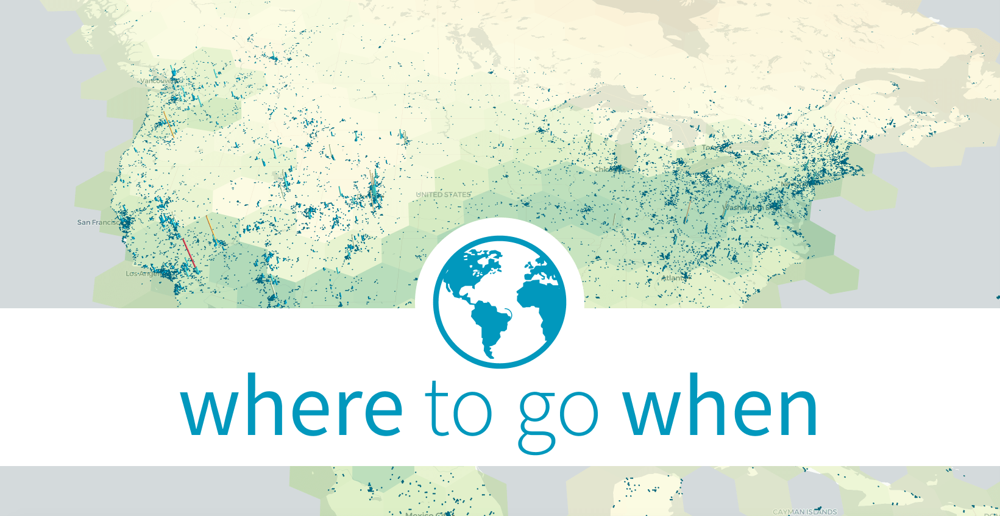

# Where to go when

 An interactive data visualization and map to discover different activities across the world and find the best time of year to travel there.

Try it out at [where-to-go-when.netlify.app](https://where-to-go-when.netlify.app).

Finalist at HackBeanPot 2021.

## Tech

Data is preprocessed, cleaned and aggregated in R. The cleaned data is then passed to a react web application using deck.gl to be visualized in the browser.

## Data Sources

- Climate / Temperature: http://berkeleyearth.org/data/
  - Binned into h3 hexagons
- Activities / Sights
  - Wikivoyage: https://github.com/baturin/wikivoyage-listings
  - Atlas Obscura: https://www.atlasobscura.com/articles/all-places-in-the-atlas-on-one-map
  - Climbing Routes: https://www.kaggle.com/pdegner/mountain-project-rotues-and-forums

